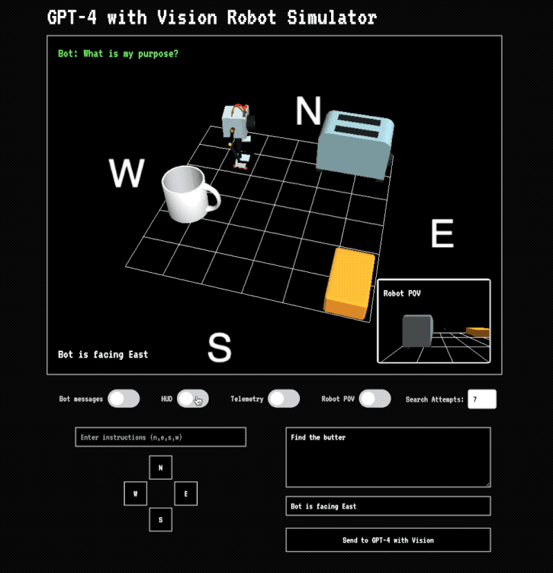

# Robot Control and Item Detection with GPT-4 Vision
This project is a web-based 3D scene that allows you to control a robot and detect items using GPT-4 with Vision. The robot can be moved using a virtual D-pad or by entering instructions in a text input field. The project uses Three.js for 3D rendering and includes features such as loading 3D models, capturing images of the scene, and sending data to a Flask server for item detection using GPT-4 with Vision.

From my blog post:
[How to use GPT-4 with Vision for Robotics and Other Applications](https://andrewmayne.com/?p=798)

## How to use

**Bot Messages**
This shows you the reasoning process the AI is using to determine what route to take.

**HUD**
This shows the POV of the robot camera. When enabled this image is sent to the vision model.

**Telemetry**
Data about what direction the robot is facing and any object it might be colliding with. When enabled this is sent to the vision model.

**Robot POV**
When enabled this makes the robot camera the primary view and what is sent to the vision model.

## Features
- Interactive 3D scene with a controllable robot and objects
- Virtual D-pad for controlling the robot's movement
- Text input field for entering movement instructions
- Capturing images of the scene and sending them to a Flask server for item detection
- GPT-4 with Vision for detecting items in the captured images
- Loading 3D models in GLB format
- Cardinal direction labels on the grid floor
- Ambient and directional lighting

## Technologies Used
- Three.js: A JavaScript library for creating and displaying 3D graphics in a web browser
- Tailwind CSS: A utility-first CSS framework for quickly styling the user interface
- Flask: A Python web framework for building the backend server
- GPT-4 with Vision: An AI model for detecting items in images
- TWEEN.js: A JavaScript tweening engine for smooth animations
- GLTFLoader: A Three.js extension for loading glTF and GLB 3D models
- FontLoader: A Three.js extension for loading font files

## Setup

1. Ensure Python and Flask are installed.
2. Install required Python packages: `flask`, `requests`, `flask_cors`, `python-dotenv`, `werkzeug`.
3. Set up an .env file with your OpenAI API key as OPENAI_API_KEY.

## Running the Application

1. Start the Flask server by running `python app.py`.
2. Access the web interface at `http://localhost:5005`.

Open the web browser and navigate to http://localhost:5005 to view the project.

## Project Structure
- templates/index.html: The main HTML file that contains the structure of the web page
- static/styles.css: The CSS file for styling the user interface
- static/app.js: The main JavaScript file that contains the Three.js scene setup, robot control logic, and image capture
- app.py: The Flask server file for handling image data and item detection using GPT-4 with Vision
- models/: Directory for storing 3D models in GLB format
- uploads/: Directory for storing captured images uploaded to the server

## Usage
- Use the virtual D-pad buttons (N, W, E, S) to move the robot in the corresponding direction
- Enter movement instructions in the text input field using the format: n,e,s,w (e.g., n,n,e,s,w)
- ress the "Send Instructions" button to execute the entered movement instructions
- Enter a prompt or question in the text area above the "Send" button
- Click the "Send" button to capture an image of the current scene along with the entered prompt
- The captured image and prompt will be sent to the Flask server for item detection using GPT-4 with Vision
- The detected items and any additional information will be displayed on the page

## Notes
There's partial code for using images and directions as a history for the application. This is meant as a starting point for anyonw wishing to improve upon this.